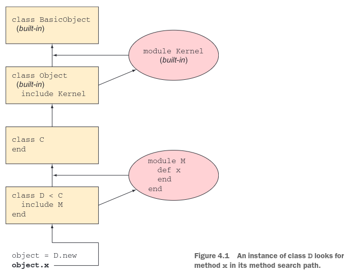

# The Well Grounded Rubyist (3rd Edition, 2019) <!-- omit in toc -->
---


<details>
<summary><b><u><font size="+2">Chapter-1: Bootstrapping you Ruby literacy</font></u></b></summary>
</details>

<details>
<summary><b><u><font size="+2">Chapter-2: Objects, method, and local variables</font></u></b></summary>
</details>

<details>
<summary><b><u><font size="+2">Chapter-3: Organizing objects with classes</font></u></b></summary>
</details>

<details>
<summary><b><u><font size="+2">Chapter-4: Modules and program organization</font></u></b></summary>

- [Basics of module creation and use](#basics-of-module-creation-and-use)
- [Modules, classes, and method lookup](#modules-classes-and-method-lookup)
  - [An Object's Eye View of Method Lookup](#an-objects-eye-view-of-method-lookup)
  - [Defining the same method more than once](#defining-the-same-method-more-than-once)
    - [Including a module more than once](#including-a-module-more-than-once)
  
# Basics of module creation and use

- `Modules` don't have instances, instead they get mixed in to classes using the `include` or the `prepend` method.
- The main difference between inheriting from a class and mixing in a module is that we can **mix in more than one module**. No class can inherit from more than one class.
  
> `require` and `load` take strings as their argu- ments, locating and loading disk files, whereas `include` `extend` , and `prepend` takes the name of a module in the form of a constant and perform a program-space, in-memory operation.
# Modules, classes, and method lookup

> The error condition is triggered by a special method called `method_missing`

> Every object in Ruby is an instance of some class descended from the big class in the sky: `BasicObject`

> It’s in `Kernel` that most of Ruby’s fundamental methods are defined. `Object` mixes in `Kernel` , all instances of `Object` and all descendants of `Object` have access to the instance methods in `Kernel`.

## An Object's Eye View of Method Lookup


> `Object` is a subclass of `BasicObject` . Every class that doesn’t have an explicit super- class is a subclass of `Object`

## Defining the same method more than once

- If you define a method twice inside the same class, **the second definition takes precedence over the first**. The same is true of modules
-  If the **object’s** method-lookup path includes two or more same-named methods, the first one encountered is the “winner” and is executed
-  The modules are searched in reverse order of inclusion

```ruby
module M 
  def report 
    puts "'report' method in module M" 
  end 
end 
module N 
  def report 
    puts "'report' method in module N" 
  end 
end 
class C 
  include M 
  include N 
end
c = C.new
c.report
# The first report method encountered in c ’s method-lookup path is the one in the most recently mixed-in module . In this case, that means N —so N ’s report method wins over M ’s method of the same name
```
### Including a module more than once

- Reincluding a module doesn’t do anything. Because M already lies on the search path, the second include M instruc- tion has no effect.
```ruby
class C 
  include M 
  include N 
  include M 
end
```

</details>
